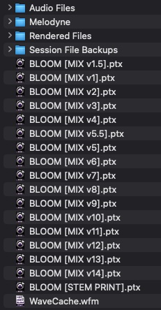
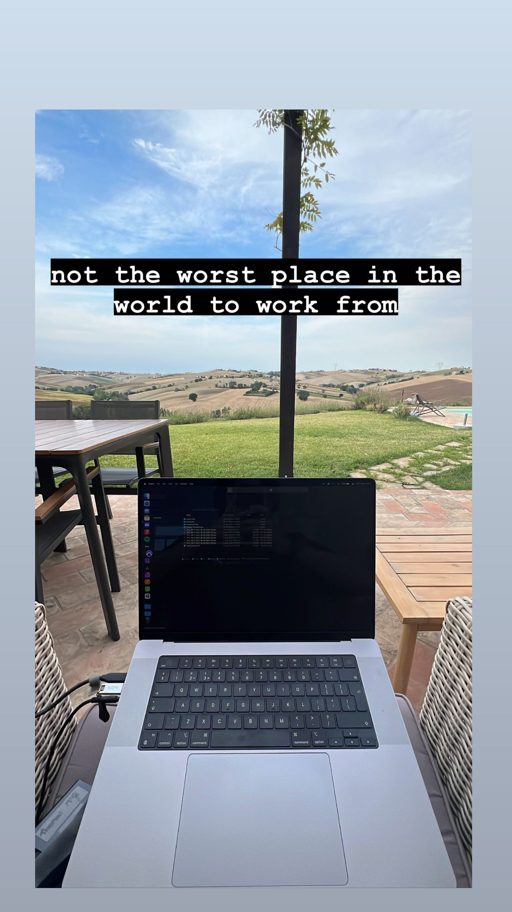

if you haven’t listened already, go check out my bands debut single, bloom! in this post, i’m going to be showcasing all the different versions of the song i could find, to show how we went from the original idea to the final master

here’s one of the first recordings i could find of bloom, the classic voice notes demo!

<audio src="../assets/posts/making-of-bloom/1.m4a">

<i><small>there's some parts of this that we didn't end up using in the final track, but are still super cool. maybe in a future song we can dig those bits up again</small></i>

we then worked on some drums and structure bits to try and work out where we wanted verses and choruses, and recorded some scratch tracks

<audio src="../assets/posts/making-of-bloom/2.mp3">

<i><small>insanely overcompressed, but i've always found i make demoes sound worse on purpose so i don't get too attached to them</small></i>

after that we decided we wanted harmonies, so i made a reallyyyy stupid midi version of the song so i could play around till we had something sounding good

<audio src="../assets/posts/making-of-bloom/3.wav">

<i><small>banger.....</small></i>

once we'd recorded the harmonies we thought we were pretty much done with bloom. the plan was to write a couple more songs until we had an EPs worth of material, then we were going to get into the studio to record everything. coming back to the song after some time off, i really felt that it was too "chuggy", 1/8th notes for a whole 3 minute song were really repetitive! i decided that i was going to try something different, so i brought the whole track into ableton, and laid it over some triplet drums i had written, and hit quantise...

<audio src="../assets/posts/making-of-bloom/4.wav">

<i><small>emma, the amazing drummer who plays on the track, wasn't happy recording that intro...</small></i>

now it's starting to sound like bloom! this was the version we ended up finalising and bringing into the studio. here's a super rough monitor bounce of the raw drum and guitar tracks

<audio src="../assets/posts/making-of-bloom/5.wav">

<i><small>listening back to this really shows how much shaping recorded drums need to sound release ready</small></i>

after recording some extra guitar parts and getting a friend to record bass, it was onto mixing! i mixed the track whilst on holiday in italy, and i really struggled to get something i was happy with, here's a screenshot of the session folder, showing all the different versions i did:

<i><small>if it wasn't for alex putting her foot down, i'd probably still be mixing the track</small></i>

<i><small>remote working is always fun</small></i>

here's a super quick and dirty thing i built that lets you compare three different mixes of bloom!

<button onclick="playAudio()">Play Audio</button>

<button onclick="solo1()">Mix 1</button>
<button onclick="solo2()">Mix 2</button>
<button onclick="solo3()">Mix 3</button>
<button onclick="solo4()">Mix 4</button>

