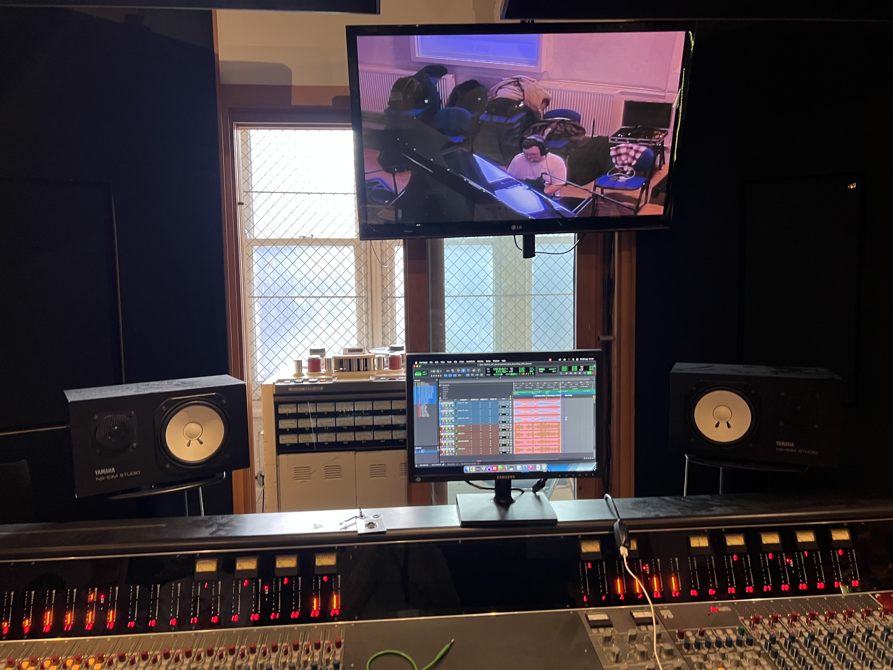

Yesterday I had the opportunity to record a choir of 35 people, made up of the London College of Music's Musical Theatre students!

Going into this project, I knew I wanted to do something a bit different, so I gave myself the task of tracking everything with the plan to mix it in Dolby Atmos. I know, I make my life more difficult than it needs to be, but it's also fairly rare to have a 35 piece choir to hand, so I was keen to make the most of it. It also gave me a great chance to dive into immersive recording techniques, 99% of my previous Atmos work has been re-mixing content into the format, using the original stereo masters as reference, so being able to go into a project with immersive at the forefront of my mind was really interesting.

I settled on a decca tree and ambisonics microphone to capture the core sound of the room, with spot mics to capture more direct sound. The decca tree was made up of 3 Telefunken M60's covering the LCR channels, and two Earthworks QTC1's handling rears, mounted on a Schoeps OCT Surround set. This was super easy to work with, and sounds great!

    

<i>I already loved the QTC1's, they were my go-to overheads for a while, but I was really impressed with the M60's!</i>

The ambisonics microphone was a Sennheiser Ambeo VR. This was positioned much higher than the decca tree as I wanted a more ambient wash/room sound, and using both the dearVR Ambi Micro and AudioBrewers AB decoder means I can turn this 4-channel microphone into a full 7.1.4 bed!

    

<i>The Ambeo VR was much smaller than I thought it'd be, but this made it super easy to position in the space.</i>

We had some time before the choir arrived, so we decided to quickly track piano, rather than using the MIDI backing that was originally sent over. We threw up some AKG C414s and a Neumann KM184 as spot mics, which really helped suppliment the decca tree and ambisonics room mic.

    

<i>This Steinway sounded fantastic, especially in the lively room.</i>

Once we'd tracked piano, we quickly moved it out of the way to make space for the choir. We spent a fair bit of time balancing them in the hall, a big focus for this session was capturing a performance in a space. Sometimes it's a bit too easy to go full-on "engineer" and try to be fully in control, but with an ensemble this large it'd be way too much work to throw up 35 microphones and manage 35 headphone mixes. Embracing the choir as a singular unit rather than 35 individual vocalists is a much more sensible option here.

Monitoring was going to be an issue though. Whilst we could've used headphones and splitters for the backing tracks, these singers hadn't been in a studio before, so I was concerned that they'd be too isolating and throw them off. I also didn't love the idea of speakers, as the bleed would've been an issue too. 

The compromise I came up with was using wedge monitors, so there was a bit of bleed in our recordings, but I also asked the performers to do a "quiet take", basically letting the track play out whilst they stood in silence, so I could invert the phase and try and null the backing track. I was keen to keep the choir in the room as I thought that because there were so many of them, and the hall was so lively,  the amount of bodies in the space would change the acoustics. I wanted to keep everything as similar as possible between the singing takes and the quiet takes.

This ended up working extremely well! After inverting the phase on my quiet takes and playing them back with the singing ones I was left with very usable, fairly clean recordings! I think I'll end up doing some additional cleanup with RX, but this seemingly simple trick means I now don't need to rely so heavily on extra processing later.

    

<i>You can see the wedge monitors on the floor in front of the group. They didn't sound great, but worked well enough for this.</i>

After tracking the main choir we moved on to soloists. I didn't want to close mic them, to keep up with this idea of capturing performances in the space, but they were also spread throughout the choir, meaning if they were to sing their parts in their choir positions the stereo spread would be too wide. By tracking them sepereately, we could move them closer together, thus having a narrower stereo image. This also allowed us to turn the monitors down a fair bit, which means less bleed, and the phase-flip-quiet-take trick work even better!

I've not yet mixed the session, I'm extremely keen to mix this in one of our Atmos rooms to ensure I don't accidentally create a stereo version that I'll be referencing later. I'm planning on deriving the stereo mix from the 2.0 folddown of the Atmos, that's what I'll share with the Musical Theatre students.

I learnt a lot from this session, it was super fun to spend some proper time on our Neve Custom 75 desk at Vestry, I think it sounds great, the preamps are fantastic, and I quite like the central monitoring section. I find I need to fader-swap every channel for it to make sense to me, but other than that it's super nice to work on. It's also always great to push my skills as a producer and recording engineer, handling 35 vocalists whilst also managing a team of 15 runners / assistant engineers consisting of our music tech students can be a challenge, but overall I'm really happy with how the session went and I think the recordings came out sounding great!

    

<i>I'm not a fan of NS10s, but the acoustics in this studio really aren't great, so I found myself using them more than the soffit-mounted ATCs in the room, as I trusted their stereo image more than the mains.</i>
