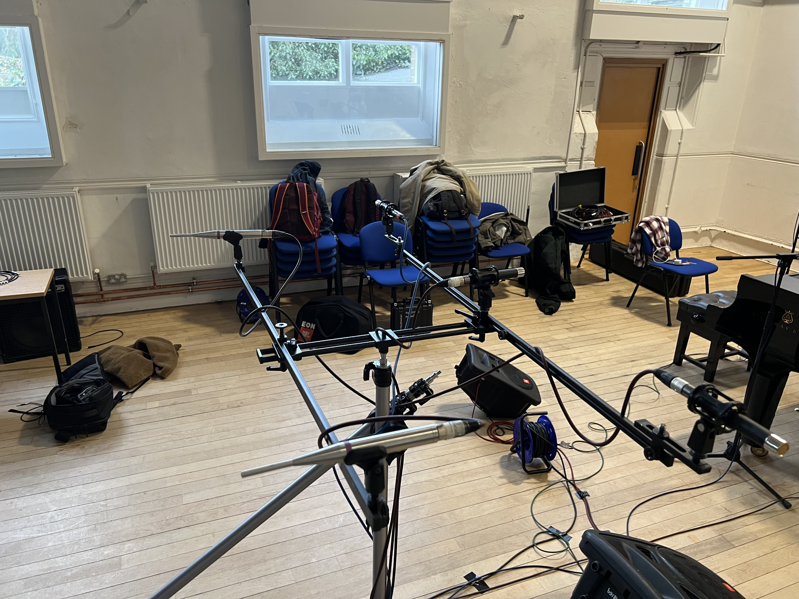
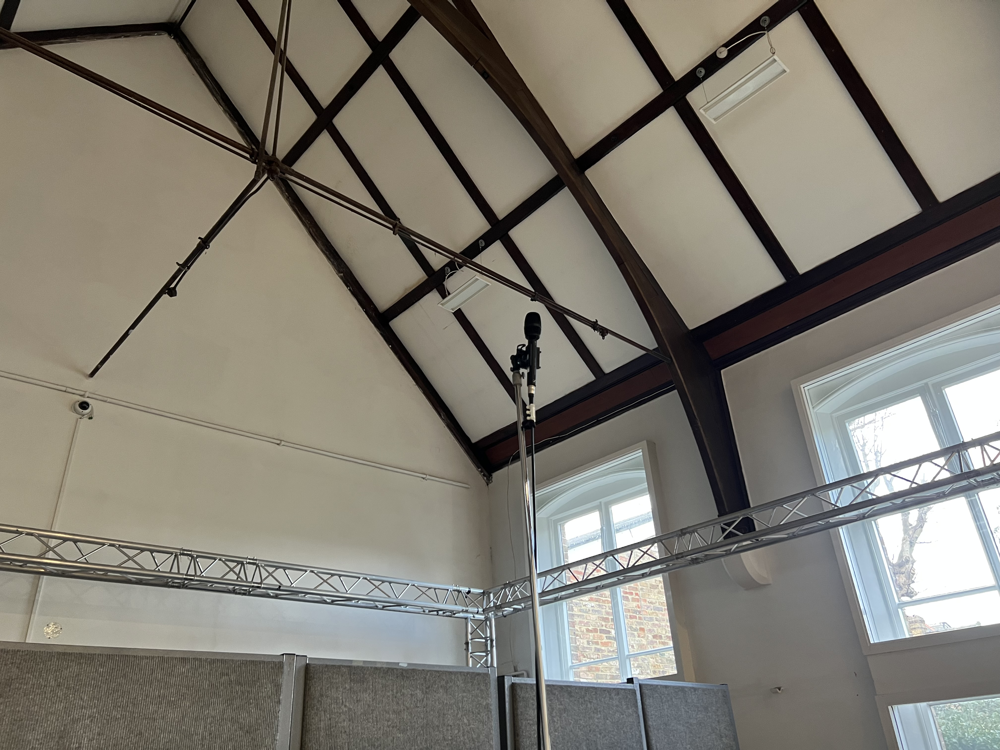
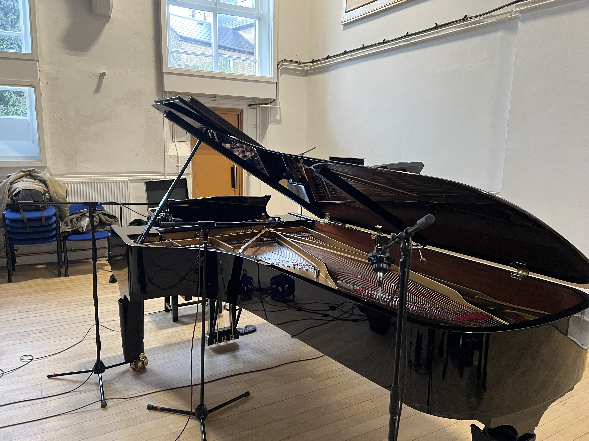
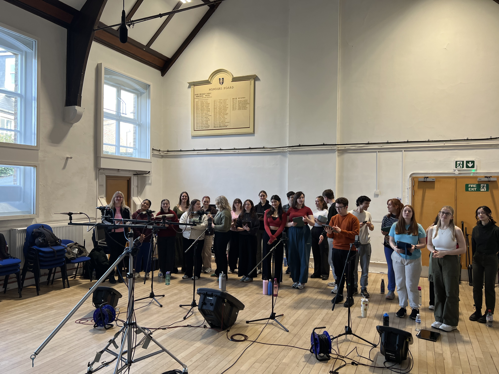

Yesterday I had the opportunity to record a choir of 35 people, made up of the London College of Music's Musical Theatre students!

Going into this project, I knew I wanted to do something a bit different, so I gave myself the task of tracking everything with the plan to mix it in Dolby Atmos. I know, I make my life more difficult than it needs to be, but it's also fairly rare to have a 35 piece choir to hand, so I was keen to make the most of it. It also gave me a great chance to dive into immersive recording techniques, 99% of my previous Atmos work has been re-mixing content into the format, using the original stereo masters as reference, so being able to go into a project with immersive at the forefront of my mind was really interesting.

In terms of microphones and placements, we settled on a decca tree and ambisonics microphone to capture the core sound of the room, with spot mics to capture more direct sound. The decca tree was made up of 3 Telefunken M60's covering the LCR channels, and two Earthworks QTC1's handling rears, mounted on a Schoeps OCT Surround set. This was super easy to work with, and sounds great!

    

<i>I already loved the QTC1's, they were my go-to overheads for a while, but I was really impressed with the M60's!</i>

The ambisonics microphone was a Sennheiser Ambeo VR. This was positioned much higher than the decca tree as I wanted a more ambient wash/room sound, and using both the dearVR Ambi Micro and AudioBrewers AB decoder means I can turn this 4-channel microphone into a full 7.1.4 bed!

    

<i>The Ambeo VR was much smaller than I thought it'd be, but this made it super easy to position in the space.</i>

We had some time before the choir arrived, so we decided to quickly track piano, rather than using the MIDI backing that was originally sent over. We threw up some AKG C414s and a Neumann KM184 as spot mics, which really helped suppliment the decca tree and ambisonics room mic.

    

<i>This Steinway sounded fantastic, especially in the lively room.</i>

Once we'd tracked piano, we quickly moved it out of the way to make space for the choir. We spent a fair bit of time balancing them in the hall, a big focus for this session was capturing a performance in a space. Sometimes it's a bit too easy to go full-on "engineer" and try and get a microphone for every singer and seperate headphone mixes, to be fully in control, but with an ensemble this large it'd be way too much work. Embracing the choir as a singular unit rather than 35 individual vocalists is a much more sensible option here.

Monitoring was going to be an issue though. Whilst we could've used headphones, these singers hadn't been in a studio before, so I was concerned that headphones would be too isolating and throw them off. I also didn't love the idea of speakers, as the bleed would've been an issue too. The compromise I came up with was using wedge monitors, so there was bleed in our recordings, but I also asked the performers to do a "quiet take", basically letting the track play out whilst they stood in silence, so I could invert the phase and try and null the backing track. I wanted the choir to stay stood as there was so many of them, I thought it would effect the room's acoustics. 

This worked extremely well, leaving me with very usable recordings of the choir!

    

<i>You can see the wedge monitors on the floor in front of the group. They didn't sound great, but worked well enough for this.</i>
