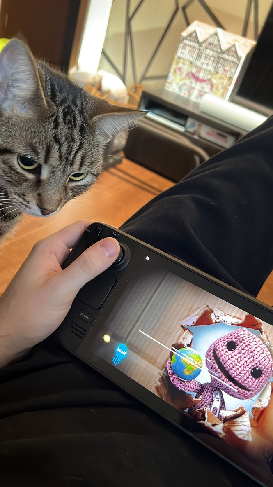

I completed the game Outer Wilds, and it's DLC - Echoes of the Eye, yesterday. I won't say anything else about the game, as the experience of going in completely blind was incredibly rewarding and has easily made it one of my favourite games of all time, so instead this post is more me being appreciative for getting back into playing games.

I used to play games a lot more than I do now, but completely fell out of love with it for a while, I think stresses of school, work and everything else got in the way and I lost the attention span to sit down and play something. I've been making more of an effort to get back into things that I used to love this year, so I'm really happy I've played this game and it's DLC to completion!

I've also been playing through a load of older games that I really enjoyed in the past. Currently I'm making my way through Little Big Planet, Gravity Rush and Super Mario 64 (the PC port makes this insanely fun!)

    

<i>Even Kiwi's getting in on the gaming</i>
