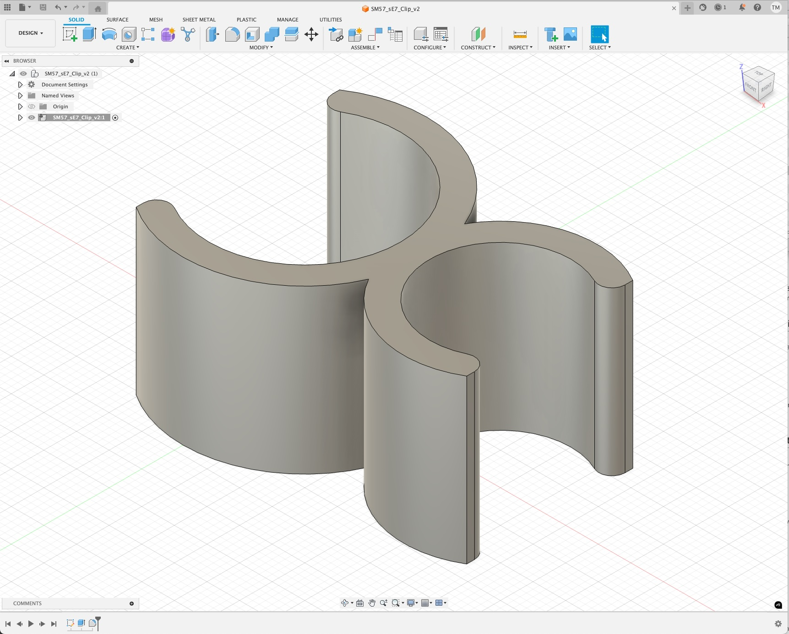

I've recently been getting into 3D printing, and I've been finding it especially fun to 3D print custom microphone clips. 

I've started with an SM57 + small diaphragm condenser clip, as this is by far the easiest, as you don't need to take into account phase alignment in the design. I measured the width of each microphone using my digital calipers, and then through some trial and error I've found a pretty decent way to ensure the microphones are held securely, but still can easily be pushed into the clip.

Subtracting about 6% from the diameter of the microphone has been working pretty well

SM57 Diameter = 31.2mm - 6% = 29.328mm
sE7 Diameter = 23mm - 6% = 21.62mm

A width of 4mm for the clip has been working well too. In theory I could reduce the width of the clip and tweak infill settings in my 3D printers slicer, but I'm still wrapping my head around 3D printing, and so I figured my brain power was better spent trying to learn Autodesk Fusion first.

I've been slicing the circles open about 15% in from the interior side, for the microphone to clip in, and also adding a 2mm fillet off the edge, which helps guide the microphone into the clip.

    

<i>I've yet to decide how I feel about Fusion. On one hand, it's pretty straightforward to get up and running, but on the other it feels like I'm missing a lot of 'best practices', which leaves me unsure on how to get the design out of my head and into the software successfully.</i>

I've got loads of ideas of where to take this. I'd love to be able to automate this, so in theory I can take measurements from any two microphones and generate an STL file to make custom clips, but for now I need to get better at CAD and 3D printing in general!

    

<i>The clip is definitely derivative of other existing designs online, but I do have many ideas on how I'm going to remix this idea into something new! </i>

*Update 2025-08-17*
I've also realised that the orientation of the print is super important, especially when working with PLA plastic. I'm trying to make a single mic clip that'll hold two SDC mics in an XY configuration, and whilst my model does work, because of how one of the model was printed, one of the clip bits has split along the layer line.