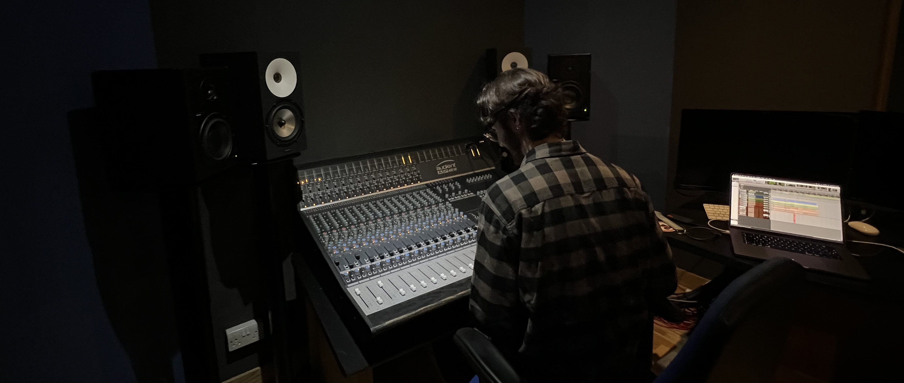

    

## Thomas McQuaid

I'm a music producer and audio engineer, based in London. I do everything from [recording, mixing and mastering](/portfolio/), live sound engineering, and [mixing for film](https://www.youtube.com/watch?v=kfp0FUM_1Kk).

I'm currently working at the University of West London as our in-house recording, mixing and mastering engineer. I was initially hired as part of our graduate internship scheme, offering mixing to students across the London College of Music, but as the internship progressed, the scope of my role has steadily grown.

I previously worked as an assistant engineer at an immersive audio mixing studio based at Tileyard. I've also worked for clients such as Marshall Amplification, TALENTBANQ, Black Deer Festival and TYX Studios, among many others.

Other than music, I'm interested in photography, technology and coffee!

You can find me online at:
